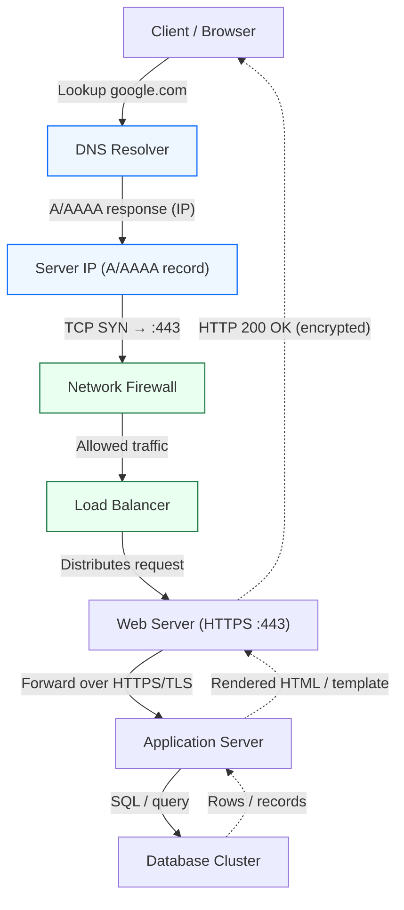

```mermaid
flowchart TB
  %% Nodes
  user["Client / Browser"]
  dns["DNS Resolver"]
  ip["Server IP (A/AAAA record)"]
  fw["Network Firewall"]
  lb["Load Balancer"]
  web["Web Server (HTTPS :443)"]
  app["Application Server"]
  db["Database Cluster"]

  %% Vertical flow
  user -->|"Lookup google.com"| dns
  dns -->|"A/AAAA response (IP)"| ip
  ip -->|"TCP SYN → :443"| fw
  fw -->|"Allowed traffic"| lb
  lb -->|"Distributes request"| web
  web -->|"Forward over HTTPS/TLS"| app
  app -->|"SQL / query"| db

  %% Return path (dashed)
  db -.->|"Rows / records"| app
  app -.->|"Rendered HTML / template"| web
  web -.->|"HTTP 200 OK (encrypted)"| user

  %% Notes / styling
  classDef sec fill:#e9fff0,stroke:#1d7a46,stroke-width:1.2px;
  classDef net fill:#eef6ff,stroke:#0d6efd,stroke-width:1.2px;
  class dns,ip net
  class fw,lb sec

  %% Extra annotations
  click web "#"
  click lb "#"
```
